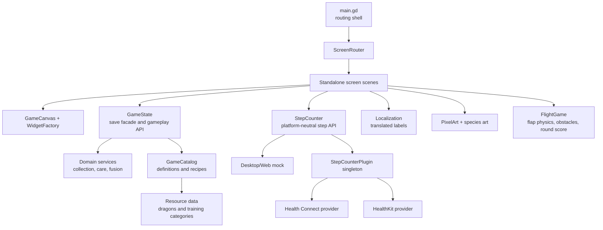
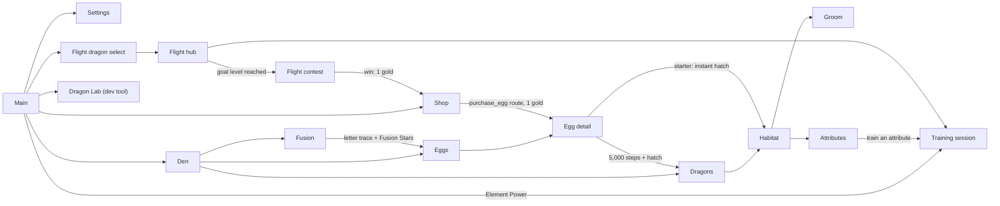

# Architecture

## Goals

The prototype is organized so gameplay rules, device APIs, and visual presentation can
change independently. The PWA remains usable without health access; native builds replace
only the step-provider bridge.



## Modules

| Module | Responsibility | Must not own |
| --- | --- | --- |
| `main.gd` | Route dispatch, responsive rebuilds, compatibility test hooks | Screen layout or gameplay rules |
| `scenes/screens/` + `scripts/screens/` | One controller and node tree per screen | Save serialization |
| `scripts/ui/game_canvas.gd` | Logical canvas fitting and safe-area conversion | Screen-specific layout |
| `scripts/ui/screen_router.gd` | Active-screen lifecycle and navigation forwarding | Gameplay rules |
| `scripts/ui/widget_factory.gd` + `ui_tokens.gd` | Shared pixel UI construction and visual tokens | Navigation or persistence |
| `scripts/game_state.gd` | Persistent instances, currencies, save migration, UI-facing gameplay API | UI nodes |
| `data/` + `scripts/data/` | Typed dragon, training-category, and fusion-recipe definitions | Player progress |
| `scripts/domain/` | Care rules, training evaluation, attributes, fusion rules, content catalog | UI nodes or save I/O |
| `scripts/step_counter.gd` | One stable step API plus desktop/web test fallback | HealthKit/Health Connect implementation details |
| `scripts/localization.gd` | Load locale catalog, translate keys, switch language | Hard-coded screen layout |
| `scripts/ui/pixel_art.gd` | Reusable code-drawn visual controls | Gameplay rules |
| `scripts/ui/talent_minigame.gd` | Base contract for every training minigame (one result or cancel per run) | Persistent XP or rewards |
| `scripts/ui/flight_game.gd`, `flame_shooter_game.gd` | Flight and Element Power minigames | Persistent XP or rewards |
| `scripts/ui/seeded_dragon.gd`, `dragon_views.gd`, `procedural_dragon_textures.gd` | Procedural dragon traits and rendering (portrait, flight, top-down) | Gameplay rules |
| `scripts/build_info.gd` | Display-only build version injected by CI | Game state |
| `native/` | Reference HealthKit and Health Connect providers | Godot screen logic |

`GameState`, `StepCounter`, and `Localization` are autoloads declared in `project.godot`.
Screens receive only canvas context and route parameters; they emit navigation requests
back through `ScreenRouter`. Gameplay mutations go through `GameState`.

## Screen flow


Every screen is a standalone scene extending `GameScreen`. Interactive state such as
grooming input, animations and egg-step callbacks stays local to its screen. `main.gd`
dispatches routes in `_on_screen_navigation` and keeps thin wrappers used by tests and
tools. `flight_training` and `flame_shooter` routes are legacy adapters around the generic
`training_session` route.

## Saved data
`GameState` stores schema-versioned JSON at `user://dragos_save.json`. The current
`SAVE_SCHEMA_VERSION` is 11. Top level:

```json
{
  "schema_version": 11,
  "currencies": {"gems": 125, "gold": 0, "fusion_stars": 3},
  "dragons": [ ... ],
  "eggs": [ ... ]
}
```

Dragon instance keys (see `_new_dragon` and `_normalize_dragon`):

| Key | Type | Meaning |
| --- | --- | --- |
| `id` | String | Stable instance ID (`luma` for the starter, else `dragon-<unix>-<rand>`) |
| `definition_id` | String | Species in `GameCatalog` |
| `starter` | bool | Hatched from the free starter egg |
| `appearance_seed` | int | Seed for procedural looks |
| `attributes` | Dict | `attack_power`, `attack_speed`, `movement_speed`, each `{value, potential}` |
| `genetics_version` | int | Version of attribute rules |
| `parent_ids`, `inheritance`, `generation` | Array, Dict, int | Fusion lineage and which parent supplied each potential |
| `hunger`, `cleanliness`, `care_points` | int, float, int | Care state |
| `training_xp`, `training_records` | Dict | Per talent ID; unknown IDs are preserved |
| `applied_training_runs` | Array | Last 32 run IDs, duplicate-result guard |
| `flight_contest_wins` | int | 0 to 3, index into goals 50/70/100 m |

Egg keys: `id`, `definition_id`, `starter`, `appearance_seed`, `attributes`,
`genetics_version`, `parent_ids`, `inheritance`, `generation`, `required_steps`,
`progress_steps`, `incubation_start`, `mock_baseline`. The hidden result is fixed when the
egg is created.

Loading normalizes every dragon and egg, migrates older schemas (legacy `species`, egg
`kind`, global care, `flight_xp`, 1,000-step eggs, direct Voltara) and resaves when the
version was older. The save is written after every mutation through `_commit_change()`.
Writes are not yet atomic (see `docs/ROADMAP.md` M1.1). Health samples are never stored,
only the incubation timestamp and aggregate progress. The Settings reset deletes the file
and restores a fresh starter egg.

Content rules: dragon definitions own identity, types, localized names and legacy art
paths. Shop eggs draw from `RANDOM_DRAGON_POOL`. Fusion recipes are order-independent;
eligibility requires two distinct dragons, enough Fusion Stars and den space (care is
not required at the moment). Pairs without a recipe produce the first parent's species.
Flight progression values come from `data/training/flight.tres`.

## Safe areas

`GameCanvas` converts the platform safe area into the 720-pixel design coordinate system
and passes the inset to every `GameScreen`. Headers and top resources stay below camera
cutouts and the Dynamic Island while background art still fills the viewport.

## Step counting

The UI calls `StepCounter`, never HealthKit or Health Connect directly. The service searches
for an engine singleton named `StepCounterPlugin`. If none exists, desktop and web use a
mock step count and expose a **+250 test steps** button.

The native bridge contract and provider sources are documented in
[`native/README.md`](../native/README.md). The iOS implementation is a packaged
Godot 4.6.1 plugin backed by a read-only HealthKit cumulative-step query. Permission
denial and unavailable health services remain recoverable states; neither prevents
the rest of the game from running.

## Localization

All player-facing strings are keys in `localization/strings.json`. Add a locale by copying
the English object, translating values, and keeping every key. Interpolated labels use
`{name}`-style values through `Localization.text(key, values)`.

## Validation
Run `tests/run_tests.sh` (see `AGENTS.md` section 4 for the suite list, the graphics
suites and CI behavior). Native HealthKit queries and physical safe-area placement still
require an iPhone.

## Change rules

1. Put reusable rules in domain services and persistence orchestration in `GameState`.
2. Access platform APIs behind a service/bridge that also has a test fallback.
3. Add labels to every locale in the catalog.
4. Add a smoke assertion for every new critical loop.
5. Avoid storing raw health data, and query only what the active feature needs.
6. Add new screens under `scenes/screens/` and route through `ScreenRouter`.

## Shared talent sessions

`training_session` receives `talent_id`, `dragon_id`, and `return_route`. The shared
screen instantiates the minigame scene from the training definition and handles live
score, results, retry, and cancellation. It checks the run, dragon, and talent IDs
before forwarding a completion to `GameState`. The legacy training screens delegate
to this screen. A new talent needs a catalog definition and a `TalentMinigame` scene,
without adding a new navigation branch or result screen.
