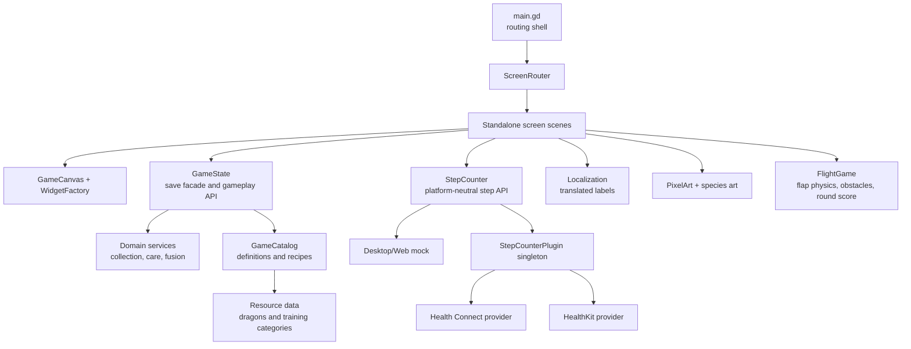
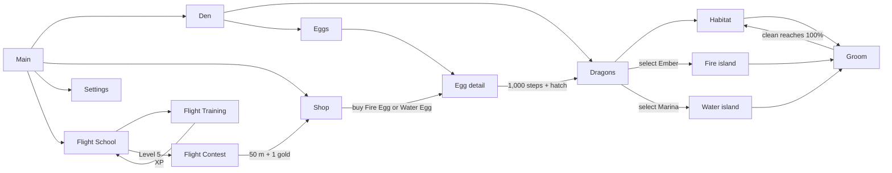

# Architecture

## Goals

The prototype is organized so gameplay rules, device APIs, and visual presentation can
change independently. The PWA remains usable without health access; native builds replace
only the step-provider bridge.



## Modules

| Module | Responsibility | Must not own |
| --- | --- | --- |
| `main.gd` | Route dispatch, responsive rebuilds, compatibility test hooks | Screen layout or gameplay rules |
| `scenes/screens/` + `scripts/screens/` | One controller and node tree per screen | Save serialization |
| `scripts/ui/game_canvas.gd` | Logical canvas fitting and safe-area conversion | Screen-specific layout |
| `scripts/ui/screen_router.gd` | Active-screen lifecycle and navigation forwarding | Gameplay rules |
| `scripts/ui/widget_factory.gd` + `ui_tokens.gd` | Shared pixel UI construction and visual tokens | Navigation or persistence |
| `scripts/game_state.gd` | Persistent instances, currencies, save migration, UI-facing gameplay API | UI nodes |
| `data/` + `scripts/data/` | Typed dragon, training-category, and fusion-recipe definitions | Player progress |
| `scripts/domain/` | Collection uniqueness, care eligibility, and deterministic fusion rules | UI nodes or save I/O |
| `scripts/step_counter.gd` | One stable step API plus desktop/web test fallback | HealthKit/Health Connect implementation details |
| `scripts/localization.gd` | Load locale catalog, translate keys, switch language | Hard-coded screen layout |
| `scripts/ui/pixel_art.gd` | Reusable code-drawn visual controls | Gameplay rules |
| `scripts/ui/flight_game.gd` | Endless flight-training physics, spike pairs, collision, score | Persistent XP or rewards |
| `scripts/build_info.gd` | Display-only build version injected by CI | Game state |
| `native/` | Reference HealthKit and Health Connect providers | Godot screen logic |

`GameState`, `StepCounter`, and `Localization` are autoloads declared in `project.godot`.
Screens receive only canvas context and route parameters; they emit navigation requests
back through `ScreenRouter`. Gameplay mutations go through `GameState`.

## Screen flow



Every current screen is a standalone scene. Interactive state such as grooming input,
flight animations, egg-step callbacks, and accessory dragging remains local to its screen.
`main.gd` keeps thin wrappers so existing debug tooling and tests can call familiar methods.

## Saved data

`GameState` stores schema-versioned JSON at `user://dragos_save.json`:

- currencies: gems, gold, and Fusion Stars;
- owned dragon instances with a definition ID, individual care, and category XP;
- eggs with their reserved dragon-definition ID, incubation time, and step progress.

The save is written only after mutations. Health samples are never stored—only the
incubation timestamp and the aggregate step result.

Schema 2 moves shared care onto each dragon, identifies content through typed definitions,
and stores training XP by category. Schema-1 saves migrate automatically from legacy
`species`, egg `kind`, global care, and `flight_xp` fields.

Load normalization collapses duplicate type signatures from older prototype saves,
prefers the starter instance, and preserves the highest care and category-XP values.
The Settings reset removes `dragos_save.json`, restores Luma and starting currencies,
and returns the router to the main screen.

Flight progression values come from `data/training/flight.tres`: ten XP equals one level,
Level 5 unlocks the contest, and each level contributes ten metres to the glide. A
successful contest awards one gold coin; eggs cost one gold.

Dragon definitions own stable identity, types, localized names, egg kinds, and art paths.
Egg selection excludes both owned dragons and dragons already reserved by pending eggs.
Fusion recipes are deterministic and order-independent; eligibility requires two distinct,
happy, groomed parents, sufficient Fusion Stars, and an unowned result. No production
fusion recipe is registered until its parent and hybrid content exist.

## Safe areas

`GameCanvas` converts the platform safe area into the 720-pixel design coordinate system
and passes the inset to every `GameScreen`. Headers and top resources stay below camera
cutouts and the Dynamic Island while background art still fills the viewport.

## Step counting

The UI calls `StepCounter`, never HealthKit or Health Connect directly. The service searches
for an engine singleton named `StepCounterPlugin`. If none exists, desktop and web use a
mock step count and expose a **+250 test steps** button.

The native bridge contract and provider sources are documented in
[`native/README.md`](../native/README.md). The iOS implementation is a packaged
Godot 4.6.1 plugin backed by a read-only HealthKit cumulative-step query. Permission
denial and unavailable health services remain recoverable states; neither prevents
the rest of the game from running.

## Localization

All player-facing strings are keys in `localization/strings.json`. Add a locale by copying
the English object, translating values, and keeping every key. Interpolated labels use
`{name}`-style values through `Localization.text(key, values)`.

## Validation

Run both deterministic test suites:

```sh
/Applications/Godot.app/Contents/MacOS/Godot \
  --headless --path . --script tests/smoke_test.gd
/Applications/Godot.app/Contents/MacOS/Godot \
  --headless --path . --script tests/domain_test.gd
/Applications/Godot.app/Contents/MacOS/Godot \
  --headless --path . --script tests/screen_routing_test.gd
```

The smoke test covers the current player loop and schema-1 migration. The domain test
covers unique egg rewards, pending reservations, deterministic fusion, care requirements,
and Fusion Star costs. The routing test instantiates every standalone screen and exercises
the shared router. Native HealthKit queries and physical safe-area placement still require
an iPhone because simulators do not provide representative personal step data.

## Change rules

1. Put reusable rules in domain services and persistence orchestration in `GameState`.
2. Access platform APIs behind a service/bridge that also has a test fallback.
3. Add labels to every locale in the catalog.
4. Add a smoke assertion for every new critical loop.
5. Avoid storing raw health data, and query only what the active feature needs.
6. Add new screens under `scenes/screens/` and route through `ScreenRouter`.
