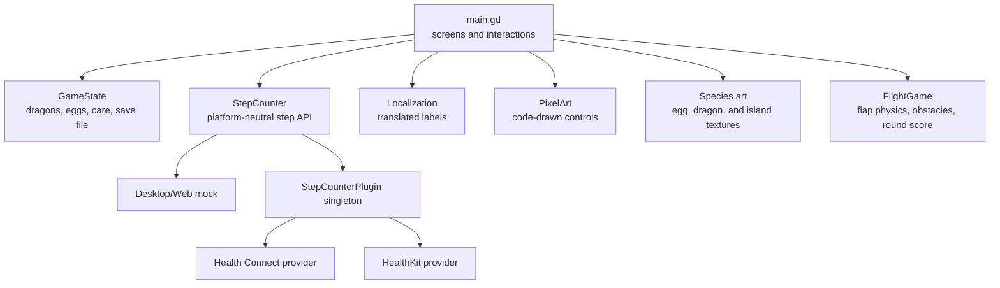
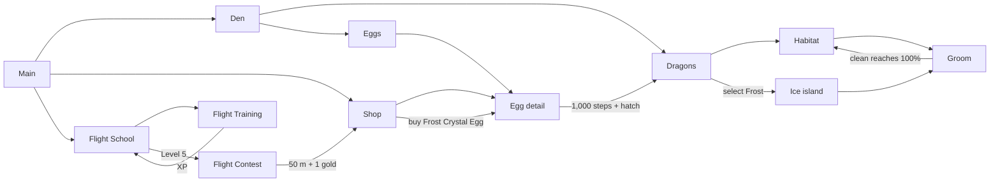

# Architecture

## Goals

The prototype is organized so gameplay rules, device APIs, and visual presentation can
change independently. The PWA remains usable without health access; native builds replace
only the step-provider bridge.



## Modules

| Module | Responsibility | Must not own |
| --- | --- | --- |
| `main.gd` | Screen composition, navigation, animation, touch input | Save format or platform health APIs |
| `scripts/game_state.gd` | Persistent care resources, dragon/egg collections, incubation rules | UI nodes |
| `scripts/step_counter.gd` | One stable step API plus desktop/web test fallback | HealthKit/Health Connect implementation details |
| `scripts/localization.gd` | Load locale catalog, translate keys, switch language | Hard-coded screen layout |
| `scripts/ui/pixel_art.gd` | Reusable code-drawn visual controls | Gameplay rules |
| `scripts/ui/flight_game.gd` | Flight-training physics, spike pairs, collision, ten-obstacle rounds | Persistent XP or rewards |
| `scripts/build_info.gd` | Display-only build version injected by CI | Game state |
| `native/` | Reference HealthKit and Health Connect providers | Godot screen logic |

`GameState`, `StepCounter`, and `Localization` are autoloads declared in
`project.godot`. They are available to every scene without passing long dependency chains
through UI nodes.

## Screen flow



`main.gd` currently creates screens in code because the prototype is highly animated and
small. New feature families should become their own scene/controller once a screen needs
independent assets or more than one developer regularly edits it.

## Saved data

`GameState` stores JSON at `user://dragos_save.json`:

- care values: hunger, cleanliness, care points;
- resources: gems and gold;
- owned dragons, their `species`, and each dragon's flight XP;
- owned eggs, their `kind`, incubation timestamp, step target, and current progress.

The save is written only after mutations. Health samples are never stored—only the
incubation timestamp and the aggregate step result.

The current egg target is `GameState.EGG_REQUIRED_STEPS` (1,000 for prototype testing).
Changing that constant affects newly purchased eggs; a migration is needed before changing
already released save schemas.

Flight progression is also owned by `GameState`: ten XP equals one level, Level 5 unlocks
the contest, and each level contributes ten metres to the contest glide. A successful
50-metre-or-longer glide awards one gold coin. Eggs cost one gold coin.

Egg kind and dragon species are persistent gameplay identifiers. The shop currently sells
an `ice` egg; hatching it creates Frost with the `ice` species. `main.gd` maps that species
to the ice-dragon portrait and winter island. Missing species values from older saves fall
back to `sunwing`, so existing Luma/Nova data keeps its original art.

## Safe areas

`main.gd` reads the platform display safe area and converts its top inset into the
720-pixel design coordinate system. Headers and top-of-screen resources use that adjusted
position on iOS and Android, keeping interactive UI below camera cutouts and the Dynamic
Island. Background art still fills the entire viewport.

## Step counting

The UI calls `StepCounter`, never HealthKit or Health Connect directly. The service searches
for an engine singleton named `StepCounterPlugin`. If none exists, desktop and web use a
mock step count and expose a **+250 test steps** button.

The native bridge contract and provider sources are documented in
[`native/README.md`](../native/README.md). The iOS implementation is a packaged
Godot 4.6.1 plugin backed by a read-only HealthKit cumulative-step query. Permission
denial and unavailable health services remain recoverable states; neither prevents
the rest of the game from running.

## Localization

All player-facing strings are keys in `localization/strings.json`. Add a locale by copying
the English object, translating values, and keeping every key. Interpolated labels use
`{name}`-style values through `Localization.text(key, values)`.

## Validation

Run the deterministic gameplay smoke test:

```sh
/Applications/Godot.app/Contents/MacOS/Godot \
  --headless --path . --script tests/smoke_test.gd
```

It covers the one-coin Frost Crystal Egg purchase, incubation via mock steps, hatching the
ice species, selecting its dedicated art, grooming completion, 50 accumulated training XP,
the Level 5 contest unlock, the 50-metre glide, and its one-coin reward. Native health
authorization/query behavior and physical safe-area placement still need device tests
because simulators do not provide representative personal step data or every camera-cutout
shape.

## Change rules

1. Put rules and persistence in `GameState`, not button callbacks.
2. Access platform APIs behind a service/bridge that also has a test fallback.
3. Add labels to every locale in the catalog.
4. Add a smoke assertion for every new critical loop.
5. Avoid storing raw health data, and query only what the active feature needs.
