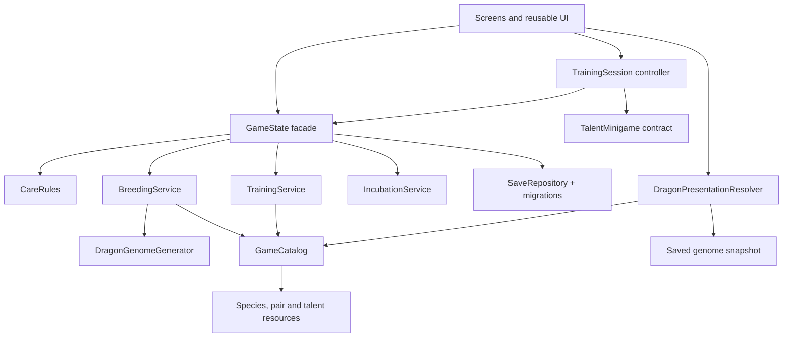

# Modular breeding and talent architecture

> Target design. Stages 1 and 2 are implemented; stages 3 to 6 are scheduled in
> `ROADMAP.md` (M3). Where this doc and `PRODUCT_DECISIONS.md` differ, the decisions win.
> Note: the implemented fusion currently allows repeated fusion of the same pair and
> lets the player pick each attribute's potential (D-09); "one child per pair" is open (Q-06).

## Purpose

This plan evolves the current prototype into a child-friendly care and breeding game
without turning it into a combat game or a speculative framework. The architecture must
make later additions cheap, but the first playable slice remains deliberately small.

The product decisions behind this plan are:

- the primary fantasy is caring for and breeding dragons;
- the target players are six and eleven years old, so the default presentation stays
  visual and simple;
- the first release has two talents: Flight and Element Power;
- talents are demonstrated through peaceful minigames and personal records, not combat;
- each parent pair initially produces one permanent child;
- a pairing has a recognizable curated hybrid species, while the child receives small
  deterministic variations in appearance and talents;
- parents are never consumed and dragons never need to be deleted or discarded;
- no dragon is a bad result: children have different strengths, not penalties.

## Version-one boundary

Version one should prove this loop:

```text
care for two dragons
        ↓
choose a valid pair
        ↓
create a deterministic egg and child blueprint
        ↓
hatch through steps or an equivalent play alternative
        ↓
discover inherited appearance and talents
        ↓
train Flight or Element Power
        ↓
receive stars, records, and descriptive feedback
```

The following are explicit non-goals for this slice:

- dragon-vs-dragon combat, an opponent ladder, or elemental weaknesses (combat
  mechanics inside minigames are allowed; HP and a survivor mode are planned later, see
  `PRODUCT_DECISIONS.md` D-03);
- more than two talents;
- recessive genes, mutations, rarity tiers, or multi-generation simulation;
- repeated children from the same pair;
- procedural creation of arbitrary species or anatomy;
- additional progression currencies;
- replacing Godot with a native SwiftUI/SpriteKit implementation.

## Current foundation

Several existing modules already point in the right direction:

- `GameCatalog` owns immutable dragon, training, and fusion definitions;
- `CollectionService`, `CareRules`, and `FusionService` keep some rules outside UI code;
- `TrainingCategoryDefinition` and the per-dragon `training_xp` map are category-based;
- each screen is a standalone scene hosted by `ScreenRouter`;
- `StepCounter` isolates HealthKit and platform fallbacks;
- saves are schema-versioned and migrated;
- `SeededDragon` proves deterministic appearance generation;
- Flight Training and the Flame Shooter provide the first two minigame candidates.

The plan should extend these seams rather than replace them all at once.

## Target module map



Dependencies flow downward. Domain services do not know about screens, textures,
translations, HealthKit, or save files. Minigames do not mutate persistent state.

## Data definitions

### Dragon species

Keep `DragonDefinition` as the curated species definition. It remains immutable content
and owns stable identity, element tags, localized name keys, and art families. A species
answers “what recognizable kind of dragon is this?” It does not contain an individual
dragon's care, parents, generated appearance, or training progress.

Later, hard-coded presentation decisions in screens should move into this definition or
a presentation profile referenced by it. UI code must not need combinations such as
`fire + earth` to choose colors, filters, islands, or labels.

### Pair definition

Evolve `FusionRecipe` into the source of truth for one allowed parent pair. A pair
definition should contain:

- stable pair ID;
- two parent species IDs, compared order-independently;
- curated result species ID;
- egg requirements;
- allowed inherited appearance slots;
- localized discovery text;
- optional cost, if Fusion Stars remain after playtesting.

The resource describes content only. Whether the pair has already produced a child is
player state and never belongs in the resource.

### Talent definition

Evolve `TrainingCategoryDefinition` into a fully data-driven `TalentDefinition`. Avoid a
rename during the first migration if it creates unnecessary churn; the important change
is the contract. Each definition should provide:

- stable ID such as `flight` or `element_power`;
- localized name and description keys;
- icon and color theme;
- minigame scene;
- score-to-XP rule and level thresholds;
- one-to-five-star feedback thresholds;
- record labels and units;
- optional peaceful challenge scene and reward policy.

Adding a third talent should require only a talent resource, its minigame scene,
translations, and tests. It must not require editing the dragon model, persistence format,
navigation switch statements, or existing minigames.

## Persistent player data

Resources are never written directly to JSON. Saves contain stable IDs and snapshots.
The next schema migration should extend a dragon instance approximately as follows:

```json
{
  "id": "dragon-...",
  "definition_id": "voltara",
  "seed": 184467,
  "generator_version": 1,
  "genome": {
    "palette": "ember_blue",
    "body": "round",
    "wings": "broad",
    "horns": "swept",
    "pattern": "spots",
    "tail": "flame"
  },
  "parent_ids": ["dragon-ember", "dragon-marina"],
  "pair_id": "ember_marina",
  "care": {
    "hunger": 42,
    "cleanliness": 28.0,
    "points": 18
  },
  "talents": {
    "flight": {"xp": 0, "best_score": 0, "stars": 1},
    "element_power": {"xp": 0, "best_score": 0, "stars": 1}
  }
}
```

Existing flat care fields can remain temporarily while accessors migrate. The stored
talent map must tolerate missing and unknown IDs so old saves gain new talents safely and
newer saves degrade gracefully in older test fixtures.

An egg created by breeding stores its child blueprint immediately:

```json
{
  "id": "egg-...",
  "definition_id": "voltara",
  "child_seed": 184467,
  "generator_version": 1,
  "genome": {"...": "complete snapshot"},
  "parent_ids": ["dragon-ember", "dragon-marina"],
  "pair_id": "ember_marina",
  "required_steps": 1000,
  "progress_steps": 0,
  "incubation_start": 0
}
```

The child is fixed when the player confirms the pairing, not when the egg hatches. Closing
the app, changing the clock, or reopening an egg can never reroll it.

## Domain services

### `DragonGenomeGenerator`

A pure generator receives parent snapshots, a pair definition, a seed, and a generator
version. It returns a complete serializable genome and starting talent affinities. It
must not load art or mutate parents.

Generation rules for the first slice stay intentionally small:

- result species comes from the curated pair definition;
- each visible slot chooses from parent-compatible or species-compatible values;
- two or three traits should visibly resemble the parents;
- talent affinities create different strengths but never permanent disadvantages;
- all values are validated against an allowed catalog before returning.

Existing dragons without a genome receive a deterministic default snapshot during save
migration. New generator versions apply only to newly created eggs. Existing dragons and
eggs always render from their stored snapshots.

### `BreedingService`

This pure service owns eligibility and child creation rules. Suggested operations are:

```gdscript
func eligibility_error(first: Dictionary, second: Dictionary, state: Dictionary) -> StringName
func preview(first: Dictionary, second: Dictionary) -> Dictionary
func create_blueprint(first: Dictionary, second: Dictionary, seed: int) -> Dictionary
```

It checks distinct parents, a registered pair, collection capacity, and whether the pair
has already produced a child. Care can unlock breeding, but low care must return an
encouraging, recoverable requirement rather than punish an existing dragon.

`GameState` performs the atomic mutation: validate, create the blueprint, add the egg,
mark the pair as used, deduct any cost, and save once.

### `TrainingService`

This pure service converts a `MinigameResult` into XP, personal best, stars, and a short
feedback descriptor. It receives care as an optional small positive multiplier. It never
loads a scene and never saves.

There should be no single combat-power number. The child-facing summary is qualitative,
for example “great flyer” or “strongest Element Power result.” The detail view may expose
levels, XP, and records for the older child.

### `IncubationService`

Move egg progress and hatch eligibility calculations behind a small service. It consumes
only aggregate progress reported through `StepCounter` or an equivalent local play route.
Both routes update the same progress field and neither owns HealthKit-specific logic.

## Minigame contract

Create a minimal base class or documented duck-typed contract named `TalentMinigame`:

```gdscript
signal run_completed(result: Dictionary)
signal run_cancelled

func configure(session: Dictionary) -> void
func start_run() -> void
```

The session contains only what play needs: dragon ID, talent ID, appearance snapshot,
difficulty, and a deterministic run seed. The completion result contains the talent ID,
raw score, normalized performance, record metrics, and run ID.

A generic `TrainingSessionScreen` should:

1. load the minigame scene from the selected talent definition;
2. configure it with a read-only session snapshot;
3. receive exactly one completion result;
4. ask `GameState` to apply it through `TrainingService`;
5. show stars, a record, and simple descriptive feedback.

The run ID is recorded or guarded for the current session so a duplicate signal cannot
award XP twice. Flight Training and Flame Shooter should be adapted to this contract
before a third minigame is added.

## Presentation rules for two age levels

One data model should support two layers of explanation:

- default layer: large icon, one-to-five stars, a record, and one short sentence;
- detail layer: level, XP progress, inherited traits, parents, and exact records.

This is progressive disclosure, not a separate child mode. A six-year-old can play by
recognizing icons and reactions; an eleven-year-old can inspect the underlying system.

`DragonPresentationResolver` combines a species definition with a saved genome snapshot
and returns presentation data. Screens use the resolver instead of branching on element
combinations. `SeededDragon` should be split so trait generation lives in
`DragonGenomeGenerator` and drawing lives in a renderer that accepts an already generated
snapshot.

## Navigation and state boundaries

`main.gd` should remain an application shell, not become the controller for every feature.
During migration:

- replace route names that perform mutations, such as `purchase_egg`, with direct calls
  from the responsible screen to the `GameState` facade followed by ordinary navigation;
- introduce generic routes such as `talent_select`, `talent_hub`, and `training_session`,
  passing `talent_id` and `dragon_id` as parameters;
- let `ScreenRouter` resolve screens through a small registry instead of expanding two
  separate `match` blocks for every new screen;
- keep debug helpers in test-only utilities instead of adding one helper per dragon or
  screen to the root scene.

Specific feature signals are preferable at UI boundaries, but a global event bus is not
needed. `GameState.state_changed` can remain while the first slice is built.

## Persistence boundary

`GameState` remains the UI-facing facade, while file operations and migrations move
gradually into `SaveRepository`. The facade should coordinate mutations but delegate
rules to services. No screen or minigame writes files directly.

Every player action that affects multiple fields is one transaction from the game's point
of view. In particular, breeding and hatching must either commit all related changes or
none of them. A write failure must not consume currency or parents in memory while losing
the egg.

## Extension checklists

### Add a talent

1. Add one `TalentDefinition` resource.
2. Add one minigame scene implementing the contract.
3. Add localized labels and record units.
4. Register the definition in `GameCatalog`.
5. Add contract, scoring, and screen-flow tests.

No dragon, breeding, save, or existing-minigame code should change.

### Add a hybrid pair

1. Add or reuse one curated result species.
2. Add one pair resource with inheritance constraints.
3. Add art-family parts needed by the renderer.
4. Add deterministic generation and eligibility fixtures.

No screen-specific element branches should change.

### Add an appearance trait

1. Add a stable trait ID and renderer asset or drawing implementation.
2. Add it to the allowed species or pair pools.
3. Increment the generator version if generation behavior changes.
4. Add snapshot and rendering tests.

Existing saved snapshots must remain valid.

## Migration sequence

Avoid a big-bang rewrite. Each stage ends with a playable build.

### Stage 1 — Contracts and characterization tests

- document the save additions and stable IDs;
- add tests around current Flight scoring, fusion eligibility, and hatch behavior;
- add a minigame result shape and verify results can be applied only once;
- keep current screens and save schema working.

**Exit:** current gameplay behaves identically, but extension contracts are executable.

### Stage 2 — Generic talents

- extend the current training definition with UI metadata and a minigame scene;
- introduce `TrainingService` and `TrainingSessionScreen`;
- adapt Flight Training and Flame Shooter;
- replace flight-specific presentation with generic talent cards while keeping temporary
  compatibility wrappers for existing tests.

**Exit:** Flight and Element Power use the same progression path; adding a third talent
does not touch persistent dragon structure or navigation.

### Stage 3 — Genome generation and rendering split

- extract deterministic traits from `SeededDragon` into `DragonGenomeGenerator`;
- render from complete snapshots;
- add generator versioning and validation;
- migrate existing dragons to species-default genomes.

**Exit:** the same saved snapshot always has the same appearance after restart and after a
generator update.

### Stage 4 — Breeding blueprint

- extend pair resources and replace recipe-only fusion rules with `BreedingService`;
- generate and store the child blueprint when breeding is confirmed;
- store parents and used pair IDs;
- hatch the stored blueprint without rerolling;
- preserve the existing fusion screen as the first breeding UI where practical.

**Exit:** one eligible pair creates one permanent, visibly inherited child.

### Stage 5 — Child-friendly feedback and lineage

- add talent stars and personal records to dragon cards;
- add an optional detail panel for exact values;
- show parent portraits and inherited-trait explanations;
- add friendly empty, locked, and permission-denied states;
- provide an equivalent non-HealthKit incubation route.

**Exit:** both target ages can understand what a dragon is good at without combat or a
manual.

### Stage 6 — Cleanup after proof

- remove temporary Flight-specific wrappers only after all callers migrate;
- move duplicated element presentation branches into definitions/resolvers;
- simplify `main.gd` routing and relocate debug-only helpers;
- update architecture diagrams and the gameplay loop to match shipped behavior.

**Exit:** the extension checklists are true in the codebase, not only in documentation.

## Required tests

The architecture is accepted only when automated tests cover:

- identical parents, seed, and generator version produce an identical blueprint;
- reversing parent selection produces the same pair and child rules;
- different seeds vary allowed traits without invalid combinations;
- a used pair cannot create a second child in version one;
- creating an egg stores parents, pair, seed, version, and full genome atomically;
- reopening or hatching an egg cannot reroll the child;
- existing dragons receive valid default genomes during migration;
- old talent maps accept the new `element_power` entry;
- unknown future talent IDs do not corrupt loading;
- a minigame completion awards progress exactly once;
- care provides only the configured positive bonus;
- permission denial leaves a playable incubation alternative;
- all player-facing text exists in English and German;
- the core flow remains usable at the existing phone viewport test sizes.

## Guardrails against overengineering

- Add an abstraction only when Flight and Element Power both use it, or when breeding
  already needs it.
- Prefer small pure services and serializable dictionaries over a deep inheritance tree.
- Keep content in resources and player progress in saves.
- Do not introduce ECS, dependency-injection containers, a global event bus, or plugin
  loading for this scope.
- Keep compatibility wrappers during migration, then delete them deliberately.
- Every stage must leave the current care, egg, and Flight loop playable.

## First implementation milestone

The recommended first coding milestone is not the full breeding system. It is a narrow
architectural proof:

1. define the generic minigame result and talent metadata;
2. run Flight and Element Power through one `TrainingService` path;
3. display both as simple talent cards on one dragon;
4. prove save/load and duplicate-result safety with tests.

Once that works, the same boundaries can safely receive deterministic breeding without
mixing three migrations into one change.

## Implementation progress — 2026-09-06

Stage 1 contract coverage is implemented in `tests/training_contract_test.gd` and
runs in CI alongside the existing fusion, hatch, and Flight characterization tests.
Both current minigames report through `TalentMinigame` and `TrainingService`.
The contract now includes cancellation: a cancelled session cannot emit a completion,
and each configured session emits at most one terminal signal.

The executable result fields are `run_id`, `dragon_id`, `talent_id`, `raw_score`, and
`metrics`. Stable talent IDs are `flight` and `element_power`. Schema 7 keeps the
existing `training_xp` map and adds `training_records` plus `applied_training_runs`.
Missing talent entries default to zero; unknown IDs survive JSON round-trips.
The last 32 applied run IDs per dragon are retained across reloads. This is a bounded
recent-result guard, not a permanent ledger of every historical run.

Tests cover both minigame adapters, XP/level/star scoring, personal bests, duplicate
completion before and after a JSON save/load round-trip, cancellation, legacy talent
maps, unknown future talents, and positive care bonuses bounded by the definition.
The round-trip tests do not exercise filesystem write failures; atomic persistence
remains part of the later persistence work.

The shared training-session screen is now implemented. Talent resources reference
minigame scenes and localized instructions. Both games use the same header, result
panel (stars, personal best, XP and level), retry flow, and session-bound completion
guard. Legacy Flight and Flame Shooter screens are thin adapters; the main menu and
Flight hub use the generic `training_session` route. Optional remaining-attempt status
comes from the minigame contract, without a game-specific screen dependency.

`tests/training_session_test.gd` covers both real talents and an additional test-only
talent registered without navigation changes. It also verifies wrong-session rejection,
late completion after leaving, retries with fresh run IDs, invalid talents, localized
metadata, text fit and safe-area buttons in German and English at two phone heights.
Gameplay and the result panel were also rendered for visual inspection.

Next: generic talent selection/cards and optional detail presentation. Genome migration
and breeding blueprints are still pending. The old Flame Shooter gameplay itself is
unchanged; adapting its theme to the peaceful product direction remains separate work.
