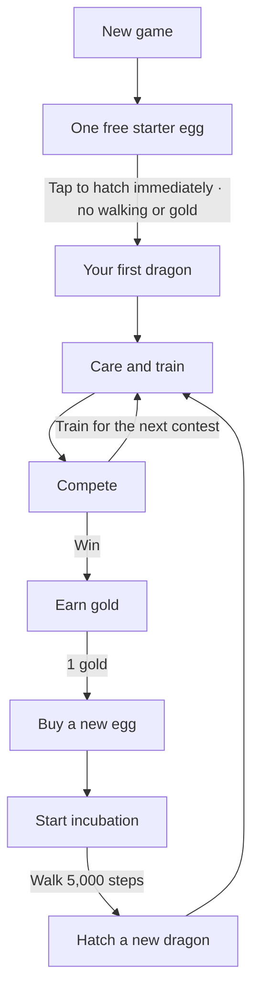

# Gameplay loop

Shared reference for the current playable loop. Update this diagram when we change progression.

## Start once, then repeat



- New games start with **one egg, zero dragons, and zero gold**.
- The starter egg is immediately ready; one tap reveals a random starter dragon and opens the habitat.
- The free egg is granted once. Relaunching preserves egg or dragon progress.
- Care improves training XP (up to +25 %). Flight contests unlock at levels 5, 7, and 10;
  each win awards 1 gold. Each dragon has its own contest progress.
- The shop sells one generic Dragon Egg for 1 gold; incubation requires 5,000 steps.
  Its hidden random dragon and appearance are fixed when granted/purchased, so reloading cannot reroll them.
- Current base pool: Sunwing, Ice, Fire, Water, Earth; repeated types are allowed, with individual potentials.
  This finite catalog is a prototype limitation, not the genetic population in the requirements.
- The shop is accessible only from the main menu. The den manages dragons, eggs, and fusion.
- All existing eggs share the generic name and artwork. Legacy and fusion outcomes are preserved.
  Desktop/web provide a test-step button.
- Existing saves retain their collection and progress. Settings → Reset starts the new egg flow.
- All playable dragons use the new seeded artwork. The same appearance follows a
  dragon through its habitat, grooming, flight, and element training, including after reload.
- The prototype saves locally; it does not yet have online accounts.

Fusion remains a side branch (two distinct parents + selected potentials + Fusion Stars → egg →
5,000 steps → hybrid). It is not required for the core loop above.

## Player fantasy

Players build a collection of unique dragons, care for them on their islands, train
them for competitions, hatch new dragons, and discover deterministic hybrid dragons
through fusion.

## Core loop

1. **Care for dragons.** Feed and groom dragons on their islands to keep them happy.
2. **Train dragons.** Choose from different training categories. Happy, well-cared-for
   dragons receive better training XP.
3. **Compete.** Enter trained dragons in the matching competition category.
4. **Earn gold.** Winning competitions awards gold.
5. **Buy eggs.** Spend gold on eggs.
6. **Hatch new dragons.** Eggs contain a new individual.
7. **Fuse dragons.** Spend Fusion Stars to combine two eligible dragons into a new,
   deterministic hybrid without losing either parent.
8. **Expand and repeat.** New dragons can be cared for, trained, entered in competitions,
   and used in future fusions.

```text
care → train → compete → gold → egg → hatch → expand collection
  └──────────────── Fusion Stars + eligible dragons → hybrid ─────┘
```

## Dragon collection

- Multiple individuals of the same type are allowed (current den capacity: 12 dragons and eggs).
- Purchased eggs draw a new individual with new potentials, including types already owned.
- Each dragon lives on an island where it can be fed and groomed.
- Care, happiness, training progress, and competition progress belong to that dragon.

## Care and happiness

- Feeding and grooming improve a dragon's happiness.
- Happiness gives bonuses, including improved XP from training.
- Care improves training; fusion currently requires two distinct dragons, currency and den space.

Care supports progression: spending time with dragons makes training and fusion more
effective.

## Training and competitions

- Training is divided into categories, such as Flight.
- Each category has its own training activity and matching competition.
- Dragons improve through training, then use that progress in competition.
- Winning competitions awards gold, which funds further egg purchases.

## Eggs

- Eggs are purchased with gold.
- Hatching an egg adds a new dragon to the collection.
- New purchases can add higher potentials; a higher value is possible, not guaranteed.

## Fusion

- Fusion uses a separate currency called **Fusion Stars**.
- Any two distinct individuals can be parents, including the same type and earlier offspring.
- Fusion does not consume or replace either parent.
- For each of the three attributes, choose which parent supplies the potential.
- Fusion adds no potential bonus and transfers no trained values.
- Existing element recipes are retained; other pairs currently use the first parent’s type.
- Repeated fusion is allowed within the den capacity and available Fusion Stars.

For example, fusing an Ice dragon with a Fire dragon creates the defined Ice/Fire
hybrid for that pairing.

## Dragon types

- Dragon types are represented as a list.
- Base dragons normally have one type.
- Current fusion dragons can have up to two types.
- The design can later support three-type dragons without changing the core loop.

## Decisions still open

- Additional training and competition categories.
- Exact happiness tiers and XP bonuses.
- How Fusion Stars are earned and how much each fusion costs.
- Egg pools, dragon rarity, and progression pacing.
- When three-type fusion becomes available.

## Attributes and selectable inheritance

Each dragon has **attack power**, **attack speed**, and **movement speed**. Each
attribute stores a trained value and a fixed individual potential. All newly hatched
dragons start at 10. Purchased/starter eggs currently roll potentials from 30 to 100
independently through their seed; these numbers are provisional balance settings.

Open **Werte / Stats** in the habitat to see and train each attribute. Attack power
and attack speed use the element minigame; movement speed uses flight training.
Earned training XP also adds points to the chosen attribute, capped at its potential.
A repeated training result cannot award points twice. Existing category XP and records
remain separate; capped combat attributes do not prevent practicing a minigame.
The attributes do not yet change minigame damage, firing rate or movement physics
(planned in `ROADMAP.md` M2). They exist for action minigames such as the auto-firing
Element Power shooter and a future survivor mode, which will also add HP. There are no
dragon-vs-dragon battles (`PRODUCT_DECISIONS.md` D-03).

Fusion stores each chosen parent ID, the exact inherited potentials and the generation
on the egg. Hatching resets all three trained values to 10, as well as the new dragon’s
training XP and records. Parent dragons retain all progress. Offspring can breed again.
Names, elemental types and graphical body traits are not yet a full genetic system.
